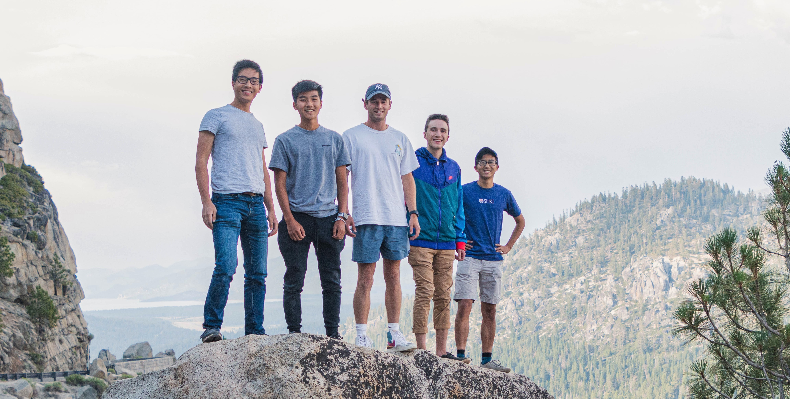
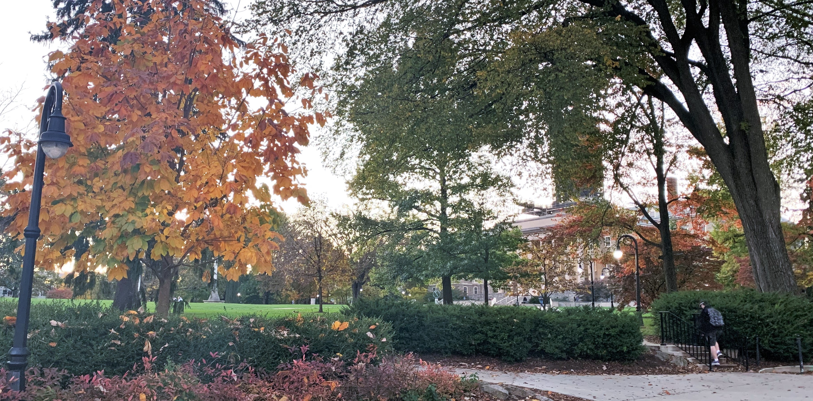
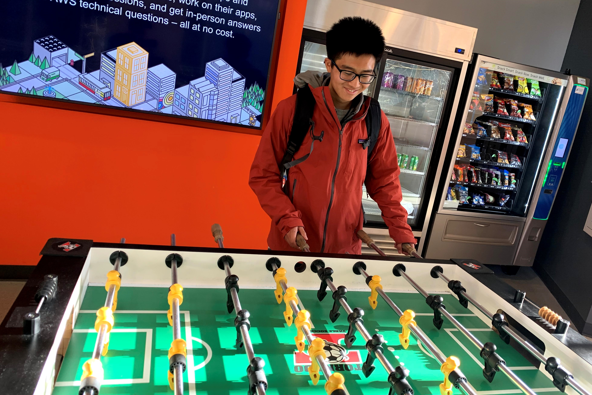

*How I left school as a non-technical student and worked in venture capital and startups.*

## Why I left school.
We enter college with unbounded career aspirations. We set out to be neuroscientists, politicians, artists, and for me a technology entrepreneur. Then we become [conformists](http://www.paulgraham.com/conformism.html).

*We don’t listen to ourselves.*

I was told that if I played the college game right I could do whatever I wanted. I got a high gpa, held leadership positions, and secured an internship.

Yet as I kept checking the boxes I seemed to be distancing myself further and further away from my original aspirations. 

I let my ego get the best of me. I was striving towards what others saw as successful.

Halfway through my sophomore year I ultimately realized that pursuing finance wasn’t getting me any closer to my tech dreams.

I left school in spring 2020 — and it has been the best decision of my life. During the first 8 months of my gap year I worked at a seed venture capital fund in San Francisco, got exposure to Silicon Valley, and ultimately joined an incredible [growth marketing startup](http://www.demandcurve.com/).

I’ll share my experience on how I left as a non-technical background, afforded to live in [San Francisco](https://www.tribecoliving.com/), and ended up readjusted my entire life trajectory.

Whether you decide to disenroll from school and fly across the country, or take an extra 10 hours from your week, I’ll walk you through how to let this remote environment be an opportunity to explore your *own* curiosities.

## Start with a side-gig
If there’s something you’re yearning to learn, don’t always settle for what’s in the classroom.

I became extremely excited by technology and equally frustrated by the lack of opportunities offered by the university. In fact the majority of my exploration came by joining incredible student orgs such as [Happy Valley Capital](http://www.hvcpsu.com/).

I started supplementing my education by working remotely for startups. I’d cold email founders that fascinated me and offer to help as a part-time intern (no strings attached). 

To my surprise, most startups were extremely receptive and respected my drive to reshape my college career. 

All while taking a full course load, I joined a [blockchain company](http://www.swissrealty.io) based in Switzerland, then later a [FinTech YC startup](http://joinpuzzl.com) in San Francisco.

- **Where to find remote opportunities:**
  - [angel.co](http://www.angel.co/) (where I started)
  - [workatastartup.com](http://www.workatastartup.com/) (where I went next)
  - On-campus clubs (entrepreneurship focused)

## Be open to different opportunities
The first two startups I joined in college were unpaid part-time positions — and the return on investment was remarkable. 

Part-time internships are the most uniquely valuable way to peek inside a company without committing 2+ years of your life.

You also don't know where opportunities will lead you. While working for the FinTech startup in San Francisco, I got connected to an incredible opportunity in venture capital.

What excited me about the opportunity was that venture capital is one of the easiest ways to segway from a finance background into tech. 

All during finals week I completed a 3-part interview, got the offer, disenrolled from class, and packed up my dorm room.

- **How to stand out while applying to startups**
  - Build a personal website ([like this site](http://www.maiale.me/))
  - Write interesting essays (shows your critical thinking skills)
  - Build a portfolio ([coding](http://www.freecodecamp.com/), design, [marketing](https://www.julian.com/guide/growth/intro))

## Taking a leave of absence
There's so much inconsistency in college. Exams, projects, and social events that take up every hour from your day. It becomes nearly impossible to focus on side-projects.

In January of 2020, I flew out to San Francisco for the first time on my own. Taking a complete pause from school helped me refocus on what I wanted to accomplish — learning and working in technology.

Although, my intentions may be different than yours — if you're just looking for experience then there's nothing stopping you from taking a lighter course load, going part-time, or supplementing your free-time. 

You need to first assess what you want to accomplish then work backward.

- **Books that influenced my gap year:**
  - [Range](https://www.goodreads.com/book/show/41795733-range?from_search=true&from_srp=true&qid=ZbiSWDDO1t&rank=1) (diversification of skills is 🔑)
  - [Ego is the Enemy](https://www.goodreads.com/book/show/27036528-ego-is-the-enemy) (Don't let your ego change your perception of success)
  - [Zero to One](https://www.goodreads.com/book/show/18050143-zero-to-one?from_search=true&from_srp=true&qid=b6f0eXcwsU&rank=1) (Differentiate yourself)
  
## Become an expert in something unique
Whether you decide to take off the year or only dedicate a few hours each week, you'll get to build moats — uniquely valuable skills.

Between both my part-time internships and gap year I learned how to raise a seed fund, invest in early stage startups, product management, and strategies. 

While none of these skills necessarily built off each other and my journey has been extremely non-linear, the diversity of perspectives helps me think more critically.

For instance, working in Biz Dev at 2 startups gave me a unique perspective while due diligencing startups in venture capital.

> “The challenge we all face is how to maintain the benefits of breadth, diverse experience, interdisciplinary thinking, and delayed concentration in a world that
increasingly incentivizes, even demands, hyperspecialization” ― David Epstein

## Meet interesting people
Building unique skills is one of the easiest ways to meet super interesting people too. You'll naturally be able to spark up conversations with people of similar interests and build a mutual connection.

I’ve gotten the opportunity to meet so many incredible people based on mutual connections of leaving school, journaling, running, and even learning Spanish.

If you don't know where to start then join a gap year community, find online forums for your interests, or chat with alumni at your university. 

- **Student communities:**
  - [Remote students](https://remotestudents.co/) (gap year community)
  - [Hiatus Work](https://www.hiatus.work/) (gap year community)
  - [Lunchclub](https://lunchclub.ai/) (have a virtual 1:1 networking lunch)
  - [Happy Valley Capital](http://www.hvcpsu.com/) (Penn State students and alumni only)
  

## Learn what you love (and hate)
You don’t know what you don’t know. 

During my gap year I got to explore working at a startup, venture capital, and ultimately a growth marketing startup. I didn't even know what growth marketing was until I came to Silicon Valley — let alone that it'd be the perfect fit for my personal interests.

Taking small risks one step at a time lets you consistently iterate and optimize for your definition of success.

## Next steps👉
Remote education is the perfect opportunity to pick up new skills as the world readjusts. No one is going to parties, no recruiters are on campus, and the rest of the world certainly isn't moving on without you.

Taking off from school was the best decision of my life and allowed me to readjust my aspirations to ultimately pursue what makes me happy. I can’t wait to come back to college with an incredibly different perspective that’ll help me make the most of my last year and a half (especially club cross country woot-woot!).

Want to hear more? DM me on Twitter: [@mattmaiale](https://twitter.com/mattmaiale?lang=en)

- **Read others' gap year stories:**
  - [Nathan Leung](https://www.natecation.com/tech-startup-gap-year-playbook/) (UMich '22 dropout)
  - [Kelvin Yu](https://www.kelv.me/gap-year) (Princeton '22 gap year)
  - [Helena Merk](https://medium.com/age-of-awareness/i-dropped-out-of-college-should-you-af9ab61231f3) (Duke '21 dropout)
 
 **Thanks** to Chloe Connor, Connie Fang, Iris Fu, Kelvin Yu, Kirti Shenoy, Leanne Shen, Nathan Leung, and Raymond Friend for reading drafts of this.
